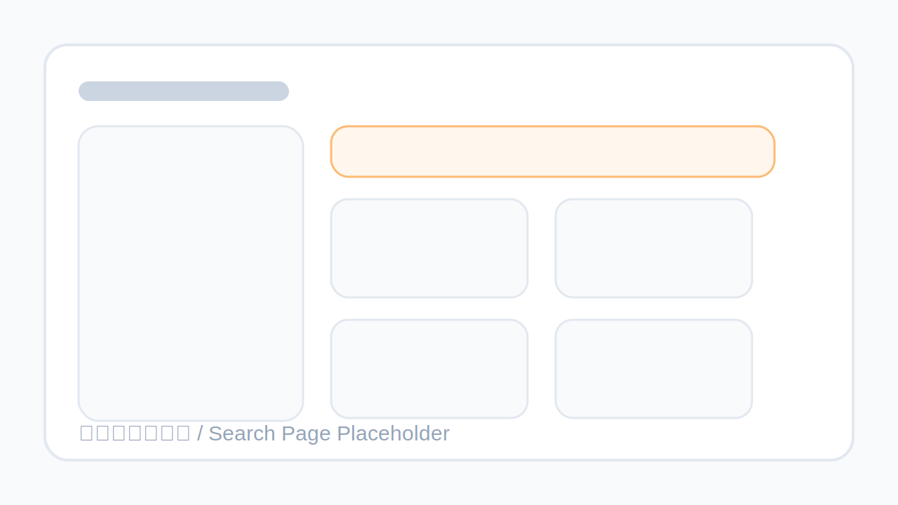
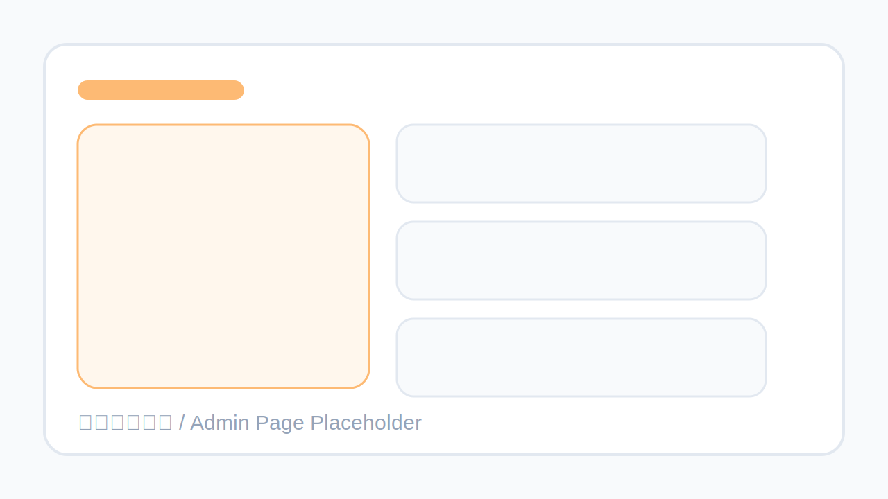
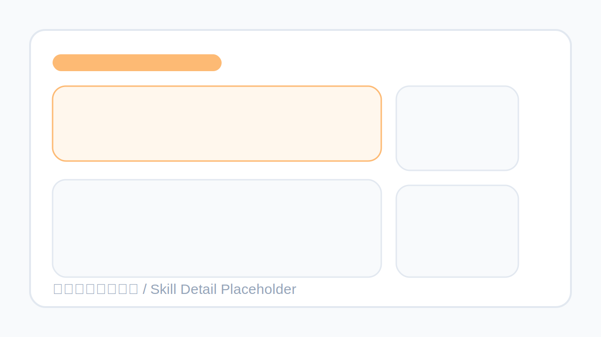

# Skills Hub

Skills Hub 是一个基于 Go + SQLite + Redis 的多租户技能中心，面向 OpenClaw 场景提供技能聚合、租户隔离、上传发布、评分评论和平台管理能力。

项目默认从 ClawHub 同步公共 Skills，同时支持租户内上传自定义 Skill ZIP 包，并通过统一的 Web 界面和 API 对外提供检索与详情展示。

## 项目介绍

Skills Hub 解决的是“公共技能发现”和“租户私有技能管理”同时存在时的落地问题。

- 公共数据：自动同步 ClawHub 公共技能，提供统一搜索入口
- 私有数据：每个租户可独立上传 Skill，并严格按租户隔离访问范围
- 用户协作：支持验证码登录、成员邀请、角色管理、租户切换
- 内容沉淀：支持 Skill 文档渲染、用户评分、Markdown 评论与预览

## 功能特性

- 多租户隔离：用户可加入多个租户，页面顶部可切换当前工作区
- 认证体系：邮箱验证码登录/注册，Redis Session，CSRF 防护，图形验证码
- API Key：用户可在个人中心创建和撤销 API Key，供 AI Agent 和自动化脚本调用
- 技能市场：首页推荐、搜索筛选、分类聚合、详情展示
- 租户上传：支持上传包含 `SKILL.md` 的 ZIP 包并自动解析元数据
- 互动能力：技能评分、评论、Markdown 预览
- 平台后台：租户创建、成员管理、邀请管理、手动同步
- 对外 API：搜索、详情、下载、分类、平台统计
- 限速保护：API Key、用户写操作、搜索请求都带 Redis 限速
- 安全增强：会话回源校验、租户越权校验、XSS/CSRF 防护、安全响应头

## 截图占位








## 技术栈

| 层级 | 技术 |
| --- | --- |
| 后端 | Go 1.21、`net/http` |
| 数据库 | SQLite (`modernc.org/sqlite`) |
| 会话/验证码/限流 | Redis |
| 模板 | Go `html/template` |
| Markdown | Goldmark + Chroma + Bluemonday |
| 前端 | Tailwind CSS CDN + 原生 JavaScript |
| 容器化 | Docker、Docker Compose |
| CI | GitHub Actions + golangci-lint |

## 目录结构

```text
.
├── db/                    # 数据访问、迁移、同步逻辑
├── handlers/              # 路由处理、模板渲染、认证授权
├── models/                # 领域模型
├── security/              # Markdown 与输入安全处理
├── static/                # 前端脚本
├── templates/             # 页面模板
├── Dockerfile             # 生产镜像构建
├── docker-compose.yml     # 本地/服务器一键启动
└── .github/workflows/ci.yml
```

## 环境变量

可参考 `.env.example`。

| 变量名 | 默认值 | 说明 |
| --- | --- | --- |
| `PORT` | `8080` | HTTP 服务监听端口 |
| `DB_PATH` | `./skills.db` | SQLite 数据库文件路径 |
| `REDIS_URL` | `127.0.0.1:6379` | Redis 地址 |
| `COOKIE_SECURE` | `false` | 生产 HTTPS 环境建议设为 `true` |
| `TRUST_PROXY_HEADERS` | `false` | 仅在可信反向代理后设为 `true` |
| `PLATFORM_ADMIN_EMAILS` | 空 | 平台管理员邮箱列表，逗号分隔 |
| `RESEND_API_KEY` | 空 | Resend 邮件 API Key |
| `MAIL_FROM` | `noreply@example.com` | 邮件发送人 |

## 安装部署

### 方式一：本地开发

#### 1. 准备依赖

- Go 1.21+
- Redis 7+

#### 2. 安装依赖

```bash
go mod download
```

#### 3. 配置环境变量

```bash
cp .env.example .env
```

如果你不使用 `.env` 工具，也可以直接导出环境变量：

```bash
export PORT=8080
export DB_PATH=./skills.db
export REDIS_URL=127.0.0.1:6379
export COOKIE_SECURE=false
export TRUST_PROXY_HEADERS=false
```

#### 4. 启动服务

```bash
go run .
```

访问地址：`http://localhost:8080`

### 方式二：Docker Compose 一键启动

```bash
docker compose up -d --build
```

默认启动内容：

- `app`：Skills Hub Web 服务
- `redis`：会话、验证码、限流存储
- `./data`：SQLite 数据持久化目录
- `./uploads`：租户上传包持久化目录

停止服务：

```bash
docker compose down
```

## Docker 镜像说明

项目提供多阶段构建的 `Dockerfile`：

- 构建阶段：使用 Go 官方镜像编译二进制文件
- 运行阶段：仅保留二进制、模板、静态资源和运行时依赖
- 支持通过环境变量配置端口、数据库路径、Redis 地址、安全策略

手动构建镜像：

```bash
docker build -t skills-hub:latest .
docker run --rm -p 8080:8080 \
  -e PORT=8080 \
  -e DB_PATH=/app/data/skills.db \
  -e REDIS_URL=host.docker.internal:6379 \
  -v $(pwd)/data:/app/data \
  -v $(pwd)/uploads:/app/uploads \
  skills-hub:latest
```

## API 文档

Base URL：`/api/v1`

说明：

- 所有 `API v1` 接口都要求 `Authorization: Bearer <api_key>`
- API Key 可在登录后的 `/account` 页面创建和撤销
- 不带 `tenant_id` 时，仅返回公共技能数据
- 带 `tenant_id` 时，必须属于该租户，否则返回 `403`

请求示例：

```bash
curl -H "Authorization: Bearer shk_xxx" "http://localhost:8080/api/v1/search?q=github"
```

### 1. 搜索技能

- 方法：`GET`
- 路径：`/api/v1/search`
- 参数：

| 参数 | 必填 | 说明 |
| --- | --- | --- |
| `q` | 否 | 搜索关键词 |
| `category` | 否 | 分类筛选 |
| `page` | 否 | 页码，默认 `1` |
| `per_page` | 否 | 每页数量，默认 `20`，最大 `100` |
| `sort` | 否 | 排序方式，支持 `rating`、`newest` |
| `tenant_id` | 否 | 目标租户 ID，访问私有上传技能时需要 |

示例：

```bash
curl -H "Authorization: Bearer shk_xxx" "http://localhost:8080/api/v1/search?q=github&category=开发工具&page=1&per_page=20"
```

### 2. 获取技能详情

- 方法：`GET`
- 路径：`/api/v1/skills/{slug}`

示例：

```bash
curl -H "Authorization: Bearer shk_xxx" "http://localhost:8080/api/v1/skills/my-skill"
```

### 3. 下载技能 ZIP

- 方法：`GET`
- 路径：`/api/v1/download/{id}`

示例：

```bash
curl -L -H "Authorization: Bearer shk_xxx" "http://localhost:8080/api/v1/download/123" -o my-skill.zip
```

### 4. 通过 API 上传 Skill

- 方法：`POST`
- 路径：`/api/v1/upload`
- 表单：`multipart/form-data`
- 字段：

| 字段 | 必填 | 说明 |
| --- | --- | --- |
| `zipfile` | 是 | 包含 `SKILL.md` 的 ZIP 文件 |
| `tenant_id` | 否 | 指定上传到哪个租户；不传时使用当前用户默认租户 |

示例：

```bash
curl -X POST \
  -H "Authorization: Bearer shk_xxx" \
  -F "zipfile=@./demo-skill.zip" \
  -F "tenant_id=1" \
  "http://localhost:8080/api/v1/upload"
```

### 5. 获取分类统计

- 方法：`GET`
- 路径：`/api/v1/categories`

示例：

```bash
curl -H "Authorization: Bearer shk_xxx" "http://localhost:8080/api/v1/categories"
```

### 6. 获取平台统计

- 方法：`GET`
- 路径：`/api/v1/stats`

## 限速规则

- API v1：每个 API Key 每分钟 60 次
- API v1：同一 IP 每分钟 300 次
- 用户写操作：每用户每分钟 10 次（评论、发布 Skill）
- 搜索：每 IP 每分钟 30 次
- 超限返回 `429`，并带 `Retry-After` header
- 平台管理员和子管理员默认不受限

## 安全说明

当前版本已包含以下安全措施：

- 会话状态每次请求回源校验，避免禁用用户或失效租户继续使用旧 Session
- 私有租户 API 访问强制校验成员关系
- CSRF Token 绑定当前 Cookie/Session 上下文
- Markdown 渲染走服务端清洗，限制危险 HTML
- 搜索建议改为安全 DOM 渲染，避免前端 `innerHTML` 注入
- 默认下发安全响应头，包括 CSP、`X-Frame-Options`、`nosniff`

## CI

仓库内置 GitHub Actions CI，默认执行：

- Go 格式检查
- `golangci-lint`
- `go test ./...`
- `go build ./...`

工作流文件：`.github/workflows/ci.yml`

## 常用命令

```bash
go test ./...
go build ./...
gofmt -w .
docker compose up -d --build
```
