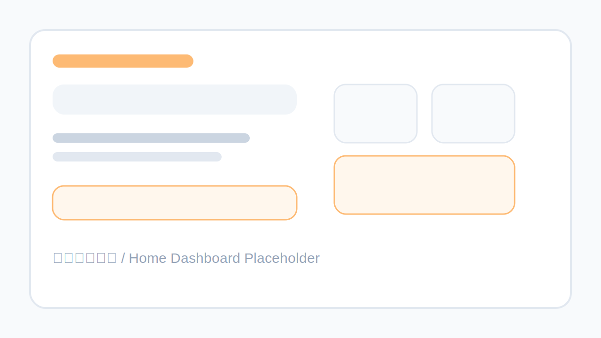

# Skills Hub

[](https://github.com/oldjs/skills-hub/actions/workflows/ci.yml)
[](https://go.dev)
[](LICENSE)
[](Dockerfile)

[English](README.md) | [中文](README.zh-CN.md)

**Skills Hub** 是 [OpenClaw](https://clawhub.ai) 的多租户技能市场，基于 Go + SQLite + Redis 构建。它从 ClawHub 聚合公共技能，同时支持租户上传、评分、评论和管理私有技能，提供统一的 Web 界面和 REST API。



## 核心功能

**技能市场**
- FTS5 全文搜索 + BM25 相关度排序
- 高级筛选：评分、时间范围、作者、来源、多分类组合
- 技能详情页：Markdown 渲染、评分、嵌套评论
- 技能版本历史 + 管理员回滚
- 收藏夹 + 自定义技能合集
- 排行榜（热门 + 近期活跃）
- 通知系统（审核结果、评论回复）

**多租户**
- 所有数据按租户隔离（技能、评分、评论）
- 注册自动创建个人租户
- 邀请机制 + 角色权限（owner / admin / member）
- 导航栏一键切换租户

**认证与安全**
- 邮箱验证码登录（无密码）
- QQ / Gmail 邮箱限制，Gmail 点号/别名规范化
- 图形验证码 + CSRF 防护 + 安全响应头
- 防暴力破解：5 次失败锁定 15 分钟
- API Key 认证（SHA-256 哈希存储）
- 多层限流（API Key / IP / 用户 / 搜索）

**管理后台**
- 30 天注册趋势和技能增长图表
- 技能审核队列 + 批量通过/拒绝
- 评论管理、用户管理、租户管理
- 操作日志 + CSV 导出
- 邮件模板在线编辑

**开发者生态**
- REST API v1（搜索、详情、下载、上传、分类、统计共 6 个端点）
- OpenAPI 3.0 文档 `/api/v1/openapi.json` + Swagger UI `/api/v1/docs`
- Agent Skill（Bash + PowerShell 双平台）

**SEO 与性能**
- 服务端渲染（Go 模板），爬虫直接可抓取
- 搜索页和技能详情页支持未登录浏览
- Meta 标签、Open Graph、Twitter Card、Canonical URL
- 动态 sitemap.xml + robots.txt
- JSON-LD 结构化数据
- HTTP 缓存头（ETag、Last-Modified、Cache-Control）
- 首页 Redis 查询缓存（60s TTL）
- 暗色模式（跟随系统偏好）

## 技术栈

| 层级 | 技术 |
|------|------|
| 后端 | Go 1.21, `net/http`, `log/slog` |
| 数据库 | SQLite (WAL 模式) via `modernc.org/sqlite` |
| 缓存/会话 | Redis 7 |
| 模板引擎 | Go `html/template` |
| Markdown | Goldmark + Chroma + Bluemonday |
| 前端 | Tailwind CSS + 原生 JavaScript |
| 图表 | Chart.js（管理后台） |
| 容器化 | Docker, Docker Compose |
| CI | GitHub Actions + golangci-lint |

## 快速开始

### Docker Compose（推荐）

```bash
git clone https://github.com/oldjs/skills-hub.git
cd skills-hub
cp .env.example .env
docker compose up -d --build
```

访问 [http://localhost:8080](http://localhost:8080)，第一个注册的用户自动成为平台管理员。

### 本地开发

环境要求：Go 1.21+、Redis 7+

```bash
go mod download
cp .env.example .env

# 启动 Redis（如果没在运行）
redis-server &

# 启动服务
go run .
```

### 初始数据同步

首次启动后从 ClawHub 同步公共技能：

```bash
go run . --sync
```

## 配置项

参考 [`.env.example`](.env.example)。

| 变量 | 默认值 | 说明 |
|------|--------|------|
| `DEV_MODE` | `false` | 本地开发模式（自动建用户和租户，自动登录） |
| `PORT` | `8080` | HTTP 监听端口 |
| `DB_PATH` | `./skills.db` | SQLite 数据库文件路径 |
| `REDIS_URL` | `127.0.0.1:6379` | Redis 地址 |
| `COOKIE_SECURE` | `false` | 生产环境（HTTPS）设为 `true` |
| `TRUST_PROXY_HEADERS` | `false` | 在反向代理后面设为 `true` |
| `PLATFORM_ADMIN_EMAILS` | | 平台管理员邮箱（逗号分隔） |
| `RESEND_API_KEY` | | [Resend](https://resend.com) 邮件 API Key |
| `MAIL_FROM` | `noreply@example.com` | 邮件发送人地址 |
| `SITE_URL` | `https://skills-hub.example.com` | SEO 用的站点根 URL |

## API 文档

所有 API v1 端点需要 `Authorization: Bearer <api_key>` 认证。API Key 在 `/account` 页面生成。

交互式文档：**`/api/v1/docs`**（Swagger UI）

```bash
# 搜索技能
curl -H "Authorization: Bearer shk_xxx" "http://localhost:8080/api/v1/search?q=browser"

# 技能详情
curl -H "Authorization: Bearer shk_xxx" "http://localhost:8080/api/v1/skills/my-skill"

# 下载 ZIP
curl -L -H "Authorization: Bearer shk_xxx" "http://localhost:8080/api/v1/download/123" -o skill.zip

# 上传技能
curl -X POST -H "Authorization: Bearer shk_xxx" -F "zipfile=@skill.zip" "http://localhost:8080/api/v1/upload"

# 分类列表
curl -H "Authorization: Bearer shk_xxx" "http://localhost:8080/api/v1/categories"

# 平台统计
curl -H "Authorization: Bearer shk_xxx" "http://localhost:8080/api/v1/stats"
```

完整 OpenAPI 3.0 规范：[`/api/v1/openapi.json`](http://localhost:8080/api/v1/openapi.json)

## Agent Skill

项目内置 Agent Skill（`skills/skills-hub/`），让 AI Agent 通过命令行直接调用 Skills Hub API。

**Linux / macOS:**
```bash
./skills/skills-hub/skills-hub.sh search "浏览器自动化"
./skills/skills-hub/skills-hub.sh install my-skill --dir ./skills
./skills/skills-hub/skills-hub.sh publish ./my-skill-dir
```

**Windows (PowerShell):**
```powershell
./skills/skills-hub/skills-hub.ps1 search "浏览器自动化"
./skills/skills-hub/skills-hub.ps1 install my-skill --dir ./skills
```

使用前设置环境变量 `SKILLS_HUB_API_KEY`，可选设置 `SKILLS_HUB_BASE_URL`。

## 目录结构

```
.
├── db/                  # 数据访问、迁移、FTS、缓存
├── handlers/            # HTTP 处理器、中间件、认证、模板渲染
├── models/              # 领域模型
├── security/            # Markdown 渲染与输入安全
├── skills/              # 内置 Agent Skill（Bash + PowerShell）
├── static/              # 前端资源（JS、CSS）
├── templates/           # HTML 模板（18 个页面）
├── Dockerfile           # 多阶段生产构建
├── docker-compose.yml   # 本地开发环境（app + Redis）
└── .github/workflows/   # CI 流水线
```

## 健康检查

```bash
curl http://localhost:8080/healthz
# {"status":"ok","db":"ok","redis":"ok"}
```

## 开发命令

```bash
# 运行测试
go test ./...

# 构建
go build ./...

# 格式化
gofmt -w .

# 代码检查（需要安装 golangci-lint）
golangci-lint run
```

## 关于 AI 辅助编程

看到 AI 写代码写得这么快，作为程序员其实挺焦虑的，总觉得哪天会被替代。但我又真的太喜欢用 AI 写代码了，这种又烦它又离不开它的感觉，可能就是现在的极客浪漫吧。

这个项目就是在这种矛盾心态下和 AI（主要是 Claude）一起写出来的。从架构设计到代码实现，甚至这段 README，都有 AI 的参与。有时候看着它几秒钟生成的代码比我想半天写的还优雅，确实会怀疑人生。但转念一想，知道「要做什么」和「为什么这样做」的还是我自己，AI 只是让执行变快了而已。

至少目前是这样。至于以后——谁知道呢。先写代码吧。

## 许可证

MIT
